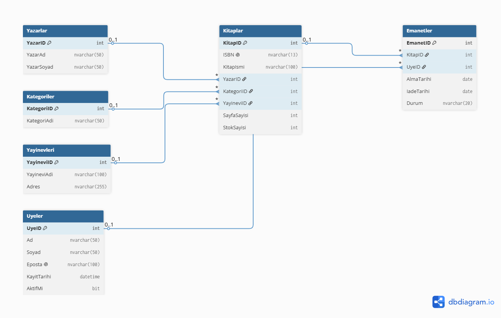
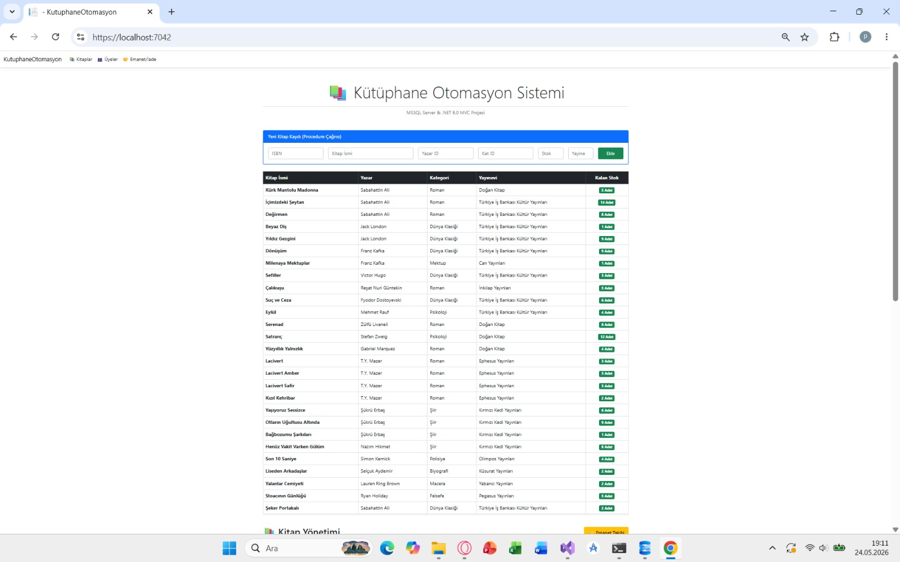
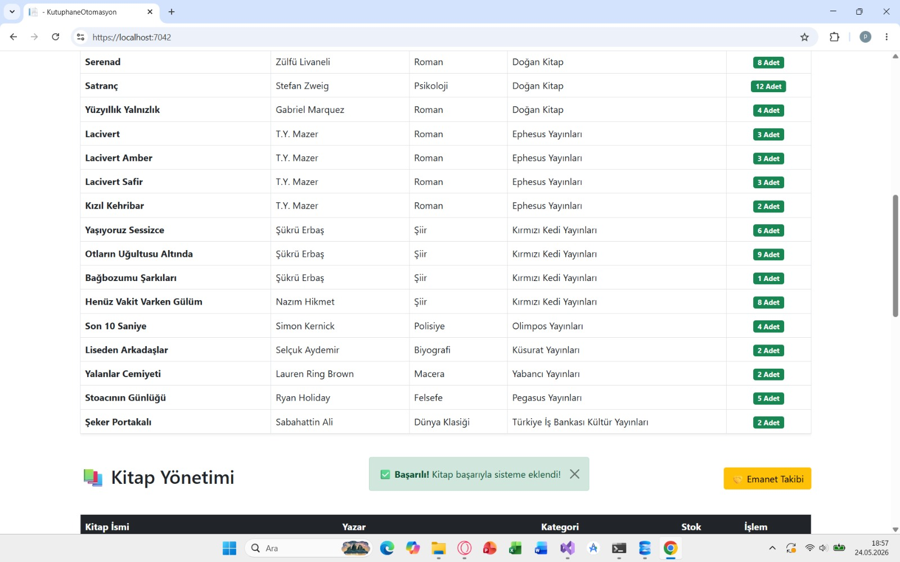
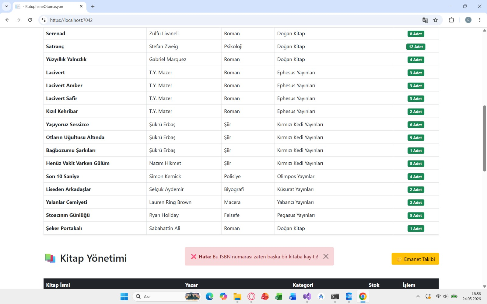
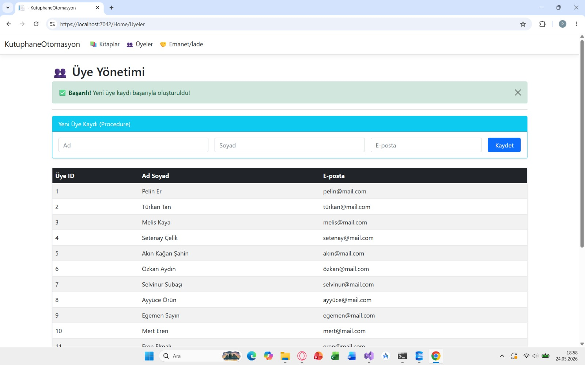
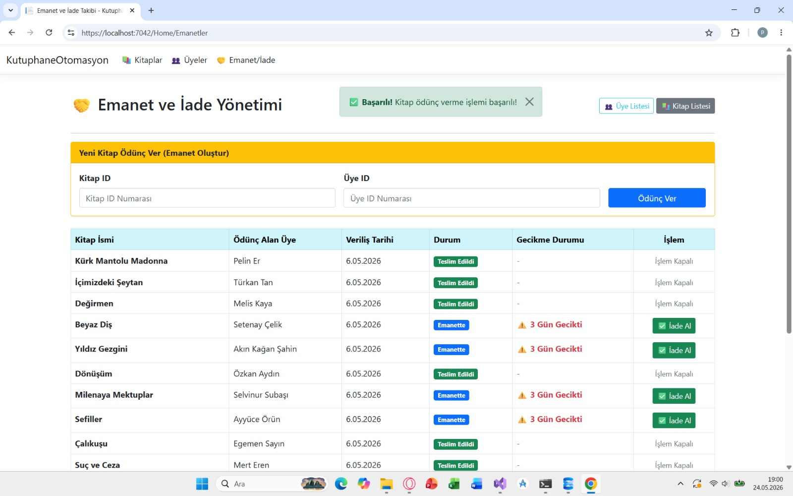
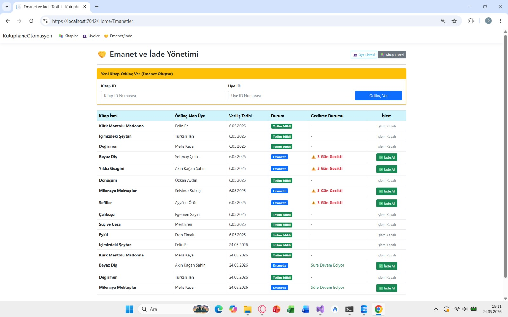

# KÜTÜPHANE OTOMASYON SİSTEMİ

## Proje Hakkında

Bu proje, Veritabanı Yönetim Sistemleri dersi kapsamında geliştirilmiş bir Kütüphane Otomasyon Sistemidir.

Projenin amacı; kitapların, üyelerin ve ödünç alma işlemlerinin dijital ortamda yönetilmesini sağlamaktır. Sistem sayesinde kitap ekleme, üye kaydı oluşturma, kitap ödünç verme, kitap iade alma ve emanet takibi gibi temel kütüphane işlemleri gerçekleştirilebilmektedir.

Proje ASP.NET Core MVC mimarisi kullanılarak geliştirilmiş ve Microsoft SQL Server veritabanı ile entegre edilmiştir.


# Kullanılan Teknolojiler

- ASP.NET Core 6.0 MVC
- C#
- Microsoft SQL Server
- SQL
- Bootstrap 5


# Problem Tanımı

Kütüphanelerde kitapların, üyelerin ve ödünç işlemlerinin manuel olarak takip edİlmesi hem zaman kaybına neden olmakta hem de sistemsel veri hatalarına sebep olabilmektedir.

Özellikle;

- Kitap stoklarının güncel kalması,
- Üye bilgilerinin düzenli saklanabilmesi,
- Ödünç verilen kitapların takip edilmesi,
- Geciken kitapların belirlenebilmesi,

gibi işlemler için merkezi bir sistem gerekmektedir.

Bu proje kapsamında geliştirilen sistem ile tüm bu işlemler tek bir platform üzerinden yönetilebilir hale getirilmiştir.


# Yapılan Araştırmalar

Proje geliştirme sürecinde aşağıdaki konular araştırılmış ve üzerinden geçilmiştir:

- İlişkisel veritabanı tasarımı
- Normalizasyon kuralları
- Primary Key ve Foreign Key yapıları
- Unique, Check ve Default Constraint kullanımı
- Stored Procedure kullanımı
- Trigger kullanımı
- View kullanımı
- Index kullanımı
- ASP.NET Core MVC mimarisi
- SQL Server bağlantı işlemleri
- Bootstrap ile kullanıcı arayüzü tasarımı


# Veritabanı Tasarımı

Veritabanı veri tekrarlarını önlemek ve veri bütünlüğünü korumak amacıyla ilişkisel yapıda tasarlanmıştır.

Sistem aşağıdaki tablolardan oluşmaktadır:

## Yazarlar

Yazar bilgilerinin tutulduğu tablodur.

Alanlar:

- YazarID
- YazarAd
- YazarSoyad

Normalizasyon: 1NF, 2NF ve 3NF kurallarına uygundur. Her yazar kaydı tekil olup tekrar eden veri bulunmamaktadır.

## Kategoriler

Kitap kategorilerinin tutulduğu tablodur.

Alanlar:

- KategoriID
- KategoriAdi

Normalizasyon: 1NF ve 2NF kurallarına uygundur. Kategori bilgisi tek bir tabloda tutulmuş ve veri tekrarı oluşmamıştır.

## Yayinevleri

Yayınevi bilgilerinin tutulduğu tablodur.

Alanlar:

- YayineviID
- YayineviAdi
- Adres

Normalizasyon: 1NF ve 2NF kurallarına uygundur. Yayınevi bilgileri kitap tablosundan ayrılarak veri tekrarının önüne geçilmiştir.

## Kitaplar

Kitap bilgilerinin tutulduğu ana tablodur.

Alanlar:

- KitapID
- ISBN
- KitapIsmi
- YazarID
- KategoriID
- YayineviID
- SayfaSayisi
- StokSayisi

Normalizasyon: 3NF’e uygundur. Yazar, kategori ve yayınevi bilgileri ayrı tablolarda tutulmuş ve kitap tablosunda sadece foreign key ilişkileri kullanılmıştır.

Özellikler:

- ISBN alanı UNIQUE olarak tanımlanmıştır.
- Sayfa sayısı negatif olamaz.
- Stok sayısı negatif olamaz.

## Uyeler

Kütüphane üyelerinin tutulduğu tablodur.

Alanlar:

- UyeID
- Ad
- Soyad
- Eposta
- KayitTarihi
- AktifMi

Normalizasyon: 1NF ve 2NF kurallarına uygundur. Üye bilgileri atomik yapıda ve e-posta alanı unique şekilde tanımlanmıştır.

Özellikler:

- E-posta alanı UNIQUE olarak tanımlanmıştır.

## Emanetler

Kitap ödünç alma işlemlerinin tutulduğu tablodur.

Alanlar:

- EmanetID
- KitapID
- UyeID
- AlmaTarihi
- IadeTarihi
- Durum

Durum alanı:

- Emanette
- Teslim Edildi
- Gecikmiş

değerlerinden birini alabilmektedir.

Normalizasyon: 2NF ve 3NF’e uygundur. İşlem bilgileri ayrı tabloda tutulmuş, kitap ve üye bilgileri foreign key ile ilişkilendirilmiştir.


# ER Diyagramı

Aşağıdaki diyagram sistemdeki tablolar ve ilişkileri göstermektedir.



### İlişkiler

- Bir yazar birden fazla kitap yazabilir.
- Bir kategori içerisinde birden fazla kitap bulunabilir.
- Bir yayınevinin birden fazla kitabı olabilir.
- Bir kitap farklı zamanlarda birden fazla kez ödünç verilebilir.
- Bir üye birden fazla kitap ödünç alabilir.


# Veri Bütünlüğü ve Constraint Kullanımı

Veritabanında veri bütünlüğünü korumak amacıyla çeşitli kısıtlamalar uygulanmıştır.

## Primary Key

Her tabloda benzersiz kayıt oluşturmak amacıyla kullanılmıştır.

## Foreign Key

Tablolar arası ilişkileri kurmak amacıyla kullanılmıştır.

Örnek:

- Kitaplar → Yazarlar
- Kitaplar → Kategoriler
- Kitaplar → Yayinevleri
- Emanetler → Kitaplar
- Emanetler → Uyeler

## Unique Constraint

Kullanıldığı alanlar:

- ISBN
- Eposta

Bu sayede aynı ISBN veya aynı e-posta ile tekrar kayıt oluşturulması engellenmiştir.

## Check Constraint

Kullanıldığı alanlar:

- SayfaSayisi > 0
- StokSayisi >= 0

## Default Constraint

Kullanıldığı alanlar:

- KayitTarihi
- AlmaTarihi
- AktifMi
- StokSayisi


# Kullanılan Veritabanı Nesneleri

## Stored Procedure

### sp_KitapEkle

Kitap ekleme işlemlerini standart hale getirmek amacıyla oluşturulmuştur.

Parametreler:

- ISBN
- KitapIsmi
- YazarID
- KatID
- Stok
- YayineviID

Örnek kullanım:

```sql
EXEC sp_KitapEkle
'9786050957501',
'Kürk Mantolu Madonna',
1,
1,
5,
1;
```


## View

### View_KitapDetaylari

Bu görünüm sayesinde kitap, yazar, kategori ve yayınevi bilgileri tek sorgu ile görüntülenebilmektedir.

Kullanılan tablolar:

- Kitaplar
- Yazarlar
- Kategoriler
- Yayinevleri

### Örnek Çıktı




## Trigger

### TRG_StokAzalt

Kitap ödünç verildiğinde otomatik olarak stok miktarını 1 azaltmaktadır.

### TRG_StokArtir

Kitap teslim edildiğinde otomatik olarak stok miktarını 1 artırmaktadır.

Bu sayede stok işlemleri manuel olarak yapılmamaktadır.


## Index

Aşağıdaki indeksler ile sistem performansı arttırılmıştır:

- IDX_KitapIsmi
- IDX_UyeEposta

Bu indeksler kitap ve üye aramalarının daha hızlı gerçekleştirilmesini sağlamaktadır.


# İş Akışı

Sistemin çalışma mantığı aşağıdaki gibidir:

1. Kullanıcı web arayüzü üzerinden işlem seçer.
2. Gerekli bilgiler forma girilir.
3. Controller katmanı verileri alır.
4. SQL işlemleri gerçekleştirilir.
5. Gerekli durumlarda Trigger çalışır.
6. Sonuç kullanıcıya gösterilir.
7. Güncel veriler ekranda görüntülenir.


# Test Verileri

Sistemin test edilmesi amacıyla örnek veriler eklenmiştir.

Eklenen veriler:

- 17 adet yazar
- 11 adet kategori
- 10 adet yayınevi
- 26 adet kitap
- 12 adet üye
- 11 adet emanet kaydı

Bu veriler kullanılarak sistemin fonksiyonları test edilmiştir.


# Uygulama Ekran Görüntüleri

## Kitap Ekleme



## Aynı ISBN ile Kitap Ekleme Hatası



Bu ekran, ISBN alanının UNIQUE olarak tanımlandığını ve aynı ISBN ile ikinci kez kayıt oluşturulamadığını göstermektedir.

## Üye Ekleme



## Kitap Ödünç Verme



## Kitap İade İşlemi




# Sonuç

Bu proje kapsamında Microsoft SQL Server ve ASP.NET Core kullanılarak çalışan bir Kütüphane Otomasyon Sistemi geliştirilmiştir.

Projede ilişkisel veritabanı tasarımı, veri bütünlüğü kuralları, stored procedure, trigger, view ve index yapıları kullanılmıştır.

Geliştirilen sistem sayesinde kitap, üye ve emanet işlemleri düzenli ve kontrollü şekilde yönetilebilmektedir.


# Kaynaklar

- Microsoft SQL Server Documentation
- Microsoft ASP.NET Core Documentation
- Bootstrap Documentation
- W3Schools SQL Tutorials
- Stack Overflow
